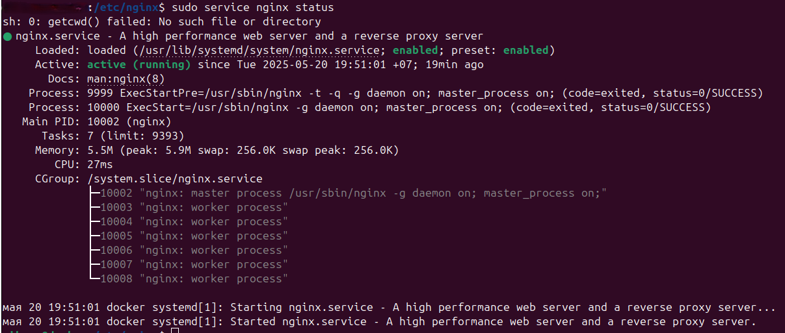

# NGINX

*Установка, удаление и настройка сервера Nginx*

### Содержание

* [Установка](#установка)
* [Управление](#управление-веб-сервером)
* [Настройка](#настройка-nginx)
* [Удаление](#удаление-nginx)

<hr>

## Установка

<strong style="font-size:15px">
Программа доступна в официальных репозиториях Ubuntu по умолчанию. 
Установить её можно непосредственно из них, 
используя систему управления пакетами <code>apt</code>
</strong>

* Для начала нужно обновить списки пакетов из репозиториев:
```html
sudo apt update
```
* После окончания процесса обновления пакетов можно установить <code>Nginx</code> на машину:
```html
sudo apt install nginx
```
* Дождемся окончания установки, а после добавим программу в автозагрузку:
```html
sudo systemctl enable nginx
```
<strong style="font-size: 15px">
Теперь нужно проверить, что веб-сервер успешно установлен и работает, а также добавлен в автозагрузку. Проверим статус работы веб-сервера:
</strong>

```html
sudo service nginx status
```



<strong style="font-size:15px">
Строка <code>«Active: active (running)...»</code>code> указывает на успешную работу сервера.
</strong><br>
<br>
<strong style="font-size:15px">
Есть и другой способ проверить его работу. Нужно вставить IP-адрес сервера в адресную строку браузера.
</strong>


* Теперь проверим его наличие в автозагрузке:
```html
sudo systemctl is-enabled nginx
```
<strong style="font-size:15px">
Если в ответ на выполненную команду получаем <code>«enabled»</code>, значит веб-сервер добавлен в автозагрузки.
</strong>

[К содержанию](#содержание)

## Управление веб-сервером
<hr>

| Функция                   |                          Команда                           |
|:--------------------------|:----------------------------------------------------------:|
| Запуск                    |                 sudo systemctl start nginx                 |
| Отключение                |                 sudo systemctl stop nginx                  |
| Перезапуск                |                sudo systemctl restart nginx                |
| Перезагрузка              |                sudo systemctl reload nginx                 |
| Проверка состояния службы |                sudo systemctl status nginx                 |
| Тестирование конфигурации |                       sudo nginx -t                        |

[К содержанию](#содержание)
## Настройка Nginx
<hr>

<strong style="font-size: 20px">
Иерархия каталогов Nginx
</strong>

* <code>/etc/nginx</code> — директория с основными файлами настроек;
* <code>/etc/nginx/nginx.conf</code> — главный конфигурационный файл Nginx;
* <code>/etc/nginx/sites-available</code> — каталог с конфигурациями для каждого из сайтов, содержащий информацию о них: имя, IP и другое;
* <code>/etc/nginx/sites-enabled</code> — в отличие от предыдущей директории, здесь содержатся конфигурации только активных сайтов, которые обслуживаются Nginx;
* <code>/etc/nginx/snippets</code> — сниппеты для подключения к основной конфигурации сервера;
* <code>/var/log/nginx</code> — директория с логами событий.
* <code>/var/www/html</code> — начальная страница;

<strong style="font-size: 15px">
Администрирование веб-сервера представляет из себя изменение и поддержку конфигурационных файлов. 
Среди них 1 файл конфигурации и 2 каталога. Это <code>nginx.conf, sites-available и sites-enabled</code> соответственно. 
Все они лежат в директории <code>/etc/nginx</code>.
</strong><br>
<br>
<strong style="font-size: 15px">
Файл <code>nginx.conf</code> — это главный конфигурационный файл.<br> 
Каталог <code>sites-available</code> содержит файлы конфигураций виртуальных хостов.
Каждый отдельный файл хранит информацию об определенном сайте. Это его имя, IP-адрес и другие данные.<br> 
Каталог <code>sites-enabled</code>, в свою очередь, состоит только из конфигураций активных сайтов.
Только из директории <code>sites-enabled</code> читаются файлы конфигурации для виртуальных хостов.<br>
Также в ней хранятся ссылки на <code>sites-available</code>. Такая структура позволяет временно отключать сайты без потери их конфигураций.
</strong>

* Рассмотрим более детально главный файл конфигурации. Для этого откроем его для просмотра, используя редактор:
```html
sudo nano /etc/nginx/nginx.conf
```
* После выполнения команды откроется файл, разделенный на модули. По умолчанию он выглядит так:


<strong style="font-size: 15px">
Каждый отдельный модуль — это директива, которая отвечает за определенные настройки веб-сервера.
Они бывают простыми и блочными.<br>
Блочные директивы, помимо имени и параметров, хранят набор дополнительных инструкций, 
размещенных внутри фигурных скобок. 
</strong>

### Перечислим некоторую часть директив главного конфигурационного файла:
* user — это пользователь, от которого осуществляются все рабочие процессы.
* worker_processes — число рабочих процессов сервера. Оно должно быть не больше, чем количество ядер процессора. Параметр auto установит число автоматически.
* pid — файл с номером главного процесса.
* include — отвечает за подключение иных файлов конфигурации, удовлетворяющих заданной маске.
* events — контекст, состоящий из директив, влияющих на работу сетевого соединения.
  * worker_connections — максимальное число одновременно работающих соединений одного рабочего процесса.
  * multi_accept — флаг, который может быть как включен (on), так и выключен (off). Если он включен, то рабочий процесс будет принимать все новые соединения, иначе только одно.
  * use — указывает метод обработки соединений. По умолчанию сервер выбирает наиболее подходящий и эффективный.
* http — контекст, состоящий из директив, отвечающих за работу HTTP-сервера.
  * sendfile — включает (on) или отключает (off) метод отправки данных sendfile().
  * tcp_nopush, tcp_nodelay — параметры, влияющие на производительность. Первый заставляет сервер отправлять заголовки HTTP-ответов одним пакетом, а второй позволяет не буферизировать данные и отправлять их короткими очередями.
  * keepalive_timeout — параметр, отвечающий за время ожидания keep-alive соединения до его разрыва со стороны сервера.
  * keepalive_requests — максимальное число запросов по одному keep-alive соединению.
  * error_log — лог ошибок веб-сервера. Для сбора ошибок в определенной секции (http, server и т.д.) необходимо разместить директиву внутри нее.
  * gzip — сжатие контента.

[К содержанию](#содержание)

## Удаление Nginx
<hr>

* Удалить пакет Nginx
```html
sudo apt-get purge nginx

#  Команда удалит пакет Nginx и его зависимости
```
* Удалить логи
```html
sudo rm -rf /var/log/nginx
```

* Проверить удаление/установку
```html
nginx -v
```
[К источнику](https://timeweb.cloud/tutorials/ubuntu/kak-ustanovit-nginx-na-ubuntu) 

<hr>